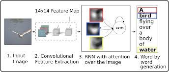
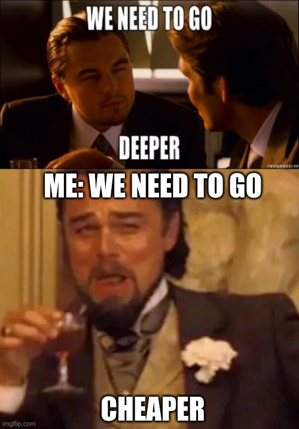
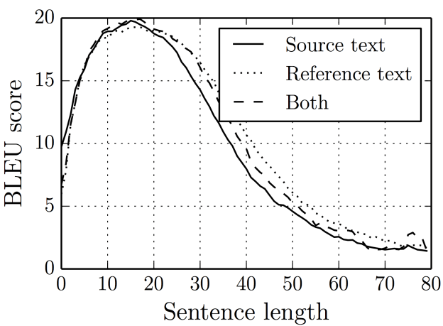
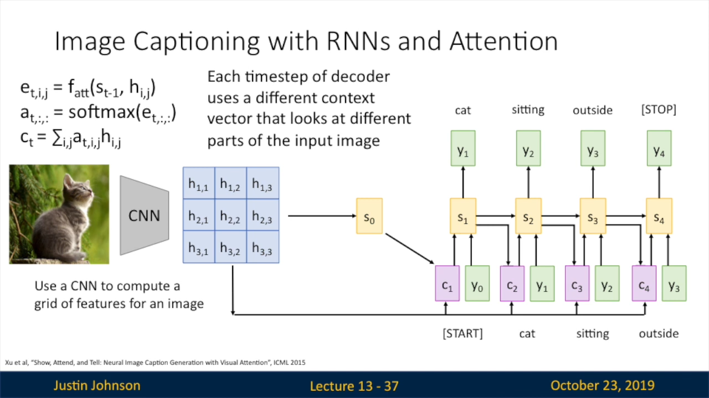
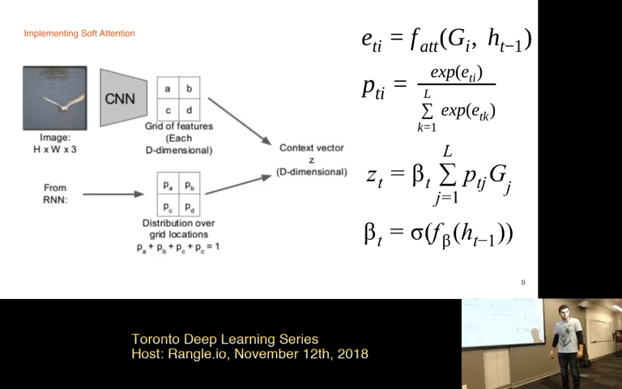
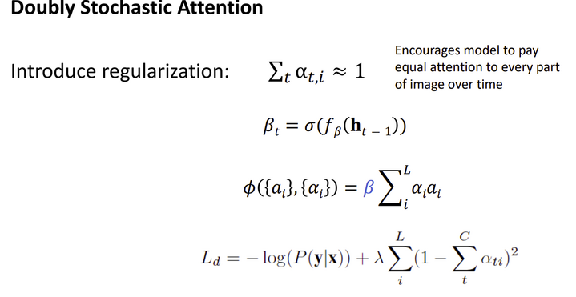
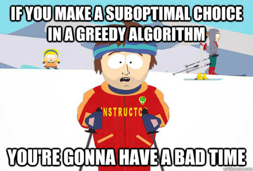
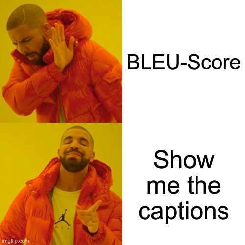
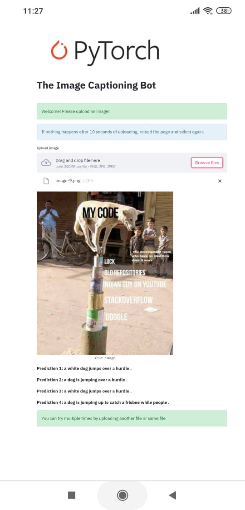

# [CaptionBot - Implementation of Show, Attend and Tell](https://arxiv.org/pdf/1502.03044.pdf)


The [Caption Bot](https://share.streamlit.io/sankalp1999/image_captioning_with_attention/main) takes your images and generates a caption in less than 40 words (even though a picture is worth a thousand words.....)

---

## Try the CaptionBot V2.0 yourself!


Check out yourself [here](https://share.streamlit.io/sankalp1999/image_captioning_with_attention/main) on Streamlit Sharing.
[Note](https://discuss.streamlit.io/t/get-path-from-file-uploader/3771/8): The uploaded images are not stored (since they are fetched as memory object, read in bytes and displayed)

### What's new?
V2 is a better model with lesser weird predictions. It is trained on Flickr30K dataset and some minor mistakes which were there in version 1 have been resolved.
For code related changes, see Flickr30Change folder.

You can check some of the results [below](https://github.com/sankalp1999/Image_Captioning/blob/main/README.md#the-good).

---

Contents of README
- [Repository structure](https://github.com/sankalp1999/Image_Captioning#repository-structure)
- [Running locally](https://github.com/sankalp1999/Image_Captioning#repository-structure)
- [Results during training](https://github.com/sankalp1999/Image_Captioning_With_Attention#during-training)
- [Streamlit samples](https://github.com/sankalp1999/Image_Captioning_With_Attention/blob/main/README.md#streamlit-samplesgood-ones)
- [Model architecture and Concepts](https://github.com/sankalp1999/Image_Captioning#model-architecture)
- [Results](https://github.com/sankalp1999/Image_Captioning#results)
- [References](https://github.com/sankalp1999/Image_Captioning#references-and-acknowledgement)

---

## Repository structure 
The repository is divided into the following structure into three parts

1. [Pytorch model files](https://github.com/sankalp1999/Image_Captioning/tree/main/pytorch_model) - You can find the actual pytorch model files here. The .ipynb file(Kaggle kernel) on which the model was trained can be found in Kaggle notebook folder. 
2. Flask_App - this is inside main/pytorch_model. This was meant to deployed using flask. The requirements.txt here is specifically for deployment using Flask.
3. Main branch -  Deployment using streamlit. Files required for streamlit deployment are here.

Flickr8K weights
You can download the weights from [Decoder_weights](https://www.dropbox.com/s/5ntq1bgp33k1197/LastModelResnet50_v2_16.pth.tar?dl=0) and [Encoder_Weights](https://www.dropbox.com/s/fot9zzgszkpsab7/resnet50_captioning.pt?dl=0).

In version 1(flickr8k), the batchnorm layer parameters(in the Resnet-50) were skewed so results were also slightly worse and random. While training a fixed feature extractor,make sure you save the weights because the batchnorm layers still track the stats even if torch.grad = False for all parameters.

Flickr30K weights

[Decoder weights](https://www.dropbox.com/s/cf2ox65vi7c2fou/Flickr30k_Decoder_10.pth.tar?dl=0)
[Encoder weights](https://www.dropbox.com/s/v0ikcdbh8w2rqii/resnet5010.pt?dl=0)

--- 

## How to run on local machine

1. Clone the repository

```python
git clone https://github.com/sankalp1999/Image_Captioning.git
cd Image_Captioning
```

2. Make a new virtual environment (Optional)

```python
pip install --user virtualenv
```

You can change name from .env to something else.

```
virtualenv -p python3 .env
source .env/bin/activate
```

3. Install the required libraries. 

**Option 1** To train a similar model or see inference on Flask

```python
cd pytorch_model
pip install -r requirements.txt 
```

You will have to download the weights and keep it some proper path that you want to use.

Only inference

```python
# To try out just the inference, set image_path in file manually.
python inference.py

# For Flask app
cd Flask_App
python app.py
```

**Option 2**  Streamlit  Note that, this is the requirements.txt in the main branch. Additionally, you need to install wget command. 

```python
pip install -r requirements.txt
apt-get install -r packages.txt # Optional way to install wget
```

```python
# Note weights will get automatically downloaded. You have to set the right path
# in the streamlit_app file. If you have already downloaded, just place 
# in the path and make the changes in streamlit_app file also

streamlit run streamlit_app.py # Run the app on local machine

```

Additional note: The only difference between the requirements.txt files is streamlit.
Streamlit is a great platform which made the deployment part much easier. It's harder to deploy on Heroku.

## During training
More examples can be directly seen on the .ipynb file in pytorch_model/kaggle_notebook.


---

---

---

---


## Streamlit samples(good ones)


---


Let's see how this was possible in the next section.

---


## Model Architecture

### General idea

The model works on sequence-to-sequence learning (Seq2Seq). This architecture was introduced by [Google](https://papers.nips.cc/paper/2014/file/a14ac55a4f27472c5d894ec1c3c743d2-Paper.pdf) in 2014.(Check out [this](https://www.youtube.com/watch?v=MqugtGD605k&ab_channel=Weights%26Biases)  and  [video](https://youtu.be/oF0Rboc4IJw) for a quick understanding of the key concepts.)

So in simple words, the encoder's task is to identify the features of the input (text in Neural Machine Translation or image in Image Captioning). These representations are provided to the "Decoder" to decode some outputs. Note that **the size of the input sequence and the output sequence is going to be different. So, the encoder passes some vector from which the decoder then decodes a sequence. **

The encoder for example take CNN continuously downsamples (convolution and max pooling continously take max of the pixels. This retains only the most important information). Then we can pass the (embedding of the words + features in  Neural Machine Translation), (embedding + CNN features Image Captioning)  and provide it to the decoder. (Attention related details have been discussed later)

Finally, we can decode the output by continuously passing the word predicted (Each word is dependent on the previously predicted words —> Conditional language modelling since we use conditional probability).  This is called greedy decoding.

To get better predictions, we use beam search. We keep track of **k most probable partial translations.** It does not guarantee an optimal solution but it is better than greedy decoding in most cases.  ****

The key thing is that we can do end-to-end training with image-text, text-text by getting the outputs from the decoder, weighing against the ground truths and perform the gradient steps. 

**Given enough such pairs, the model will work.**

For more details of the concepts, refer [CS224N, Lecture 8](https://youtu.be/XXtpJxZBa2c).

## Implementation Details and Concepts involved

Based on the paper - Show, Attend and Tell

### Datasets used

Flickr8K- It is a relatively small dataset of 8000 images with 5 captions each. There are two versions found on the web - one with splits and one without splits. I used the latter and created manual split.  

Flickr30K (in version 2) - 31000 images with 5 captions each. It's better to train on Flickr30K after training on Flickr8k because one epoch takes much longer.
> "Our data set  consists of 31,783 photographs of everyday activities, events and scenes (all harvested from Flickr) and 158,915 captions
  (obtained via crowdsourcing).", [paper](http://hockenmaier.cs.illinois.edu/DenotationGraph/TACLDenotationGraph.pdf)

### Seq2Seq model



### Encoder

**Use of transfer learning**

Other existing (better) implementations use deeper CNN's (Resnet 101, 152) 



But for (free) deployment purposes, size constraints. 

> Resnet 101 weights are around 170 MB while resnet-50 are around 98 MB. Heroku gives around ~ 500 MB while Streamlit ~800 MB storage.

I use a pre-trained Resnet 50 model (without fine-tuning). Resnet-50 is trained on ImageNet which contains a lot of dogs (which explains the model's liking for dogs.) This saves a lot of effort because it has already been trained on millions of images.

We remove the last three layers( as more spatial information can be found in the lower layers).  And take the feature representation. Then, reshaping and permuting is needed for operations in the decoder. The paper mentions to bring the shape to (batch_size, num_pixel = 14 x 14 , encoder_dim = 1024)

Final encoding before passing to decoder will be (batch_size, 14, 14, 1024 ). This is called as the annotation vector in the paper.

Check in the pytorch_model/model.py . 

### Embedding layer

The embeddings are trained on the vocabulary of Flickr8K. I decided to not use pretrained-embeddings because of size-constraints and secondly it has been found that training on your dataset's vocabulary is sometimes equally accurate (because of context of the images and captions). So, we use the standard nn.Embedding layer for training the embeddings.

The vocabulary threshold is 2 (although the initial models I had trained had a vocabulary threshold of 5). The threshold means the number of occurences of the word to include it in my vocabulary which is a mapping of words to indices and vice-versa. 

With threshold = 2, vocab size is 5011. I saw a decrease in BLEU score but better captions.

With threshold = 5, vocab size was 2873.

Flickr30K

With threshold = 5, vocab size is 7547.

### Decoder
The main training part of the project was training the decoder with soft attention mechanism (and the embedding ).

We use an nn.LSTMCell for our Decoder and not nn.LSTM. It's easier to get the hidden steps at each time step from LSTMCell. I won't put a picture here of LSTMCell equations because they scare me.

### Attention network (soft attention)

A huge problem with Encoder-Decoder network without attention is that the LSTM's performance declines rapidly as the sequences keep getting longer. This was a big problem in the Machine translation task. Naturally, even human beings find it hard to memorize long sentences. 

This problem was because of calculating only one context vector in which you squash all the information.

But if you observe translators, they hear the sentence pieces, give attention to certain pieces and then translate. They don't memorize the whole thing at once and then translate. Attention works in the same way.  **We focus on specific objects with high resolution.**



To address this issue, Soft attention was introduced in **[Neural Machine Translation by Jointly Learning to Align and Translate](https://arxiv.org/pdf/1409.0473.pdf).**  The authors of Show ,Attend and Tell adapt soft attention mechanism with some modifications/additions. They also 
introduce a "Hard attention" mechanism (which is more complicated and cannot be trained by backpropagation)

Coming back to CaptionBot, we pass the encoding(features) along with the hidden state(all the timesteps) of current batch to the attention network. **Here, we calculate context for each hidden state timestep and return a context vector.**

Thus, this seems like the model can attend to different features of the image and get the "context".

We pass this context vector with the embedding to the decoder. Then, we get the predictions and repeat. (Train time) 



For better visualization, refer [this](https://youtu.be/StOFwSRBwMo) video.

The soft attention is differentiable and hence can be trained using backpropgation. It is a small neural network model of it's own. The BahdanauAttention class in the [model.py](http://model.py) file is implementing the attention network which calculates the attention weights(alphas) and context vector. 



### Doubly stochastic attention
The authors introduce doubly stochastic attention which involves using a sigmoid gate over a "beta" learning parameter(essenetially a FC layer) to encourage 
(alpha * attention_weights).sum() to be near 1. 

They also introduce a term to add in to the overall loss.




### Greedy decoding

Selects the best prediction and passes the embedding of this prediction along with the context vector. This often works but then you want to be sure that your current choice is optimal, then only your caption will be optimal since the future words are dependent on previous words.



During training time, i used the greedy caption (for the first three-four models). The model could make good captions but it predicted wrong colors. It associated the context of man with red t-shirt a lot of times! 

Suboptimal choice —> Not the best word —> Totally different sentence —> Bad alignment  with image

### Beam Search
The greedy algorithm can lead to sub-optimal solution. Another solution is to use Exhaustive Search but it's time complexity would be exponential hence
this is not feasible. So, we turn to beam search.

Beam search is the game-changer. This part in the code is heavily inspired from sgrvinod implementation.

We maintain top k partial translations with the scores for each sequence. Each sequence may end at a different time step. So, when a sequence finishes, we remove it from the sequence list. We also have a max - sequence length.

Finally, select a sequence with the max score.

The predictions in the CaptionBot are with beam indices 2..5

## Results




I calculated the BLEU score over 580 images with 5 captions each. 
This score was attained near 14th epoch. (I trained the deployed model from 10th epoch with fixed BLEU evaluator. BLEU requires tokenized text.)


### Flickr8K model 

| Torch metric | Score   |
|--------------|---------|
| BLEU-1       |  0.5501 |
| BLEU-2       |  0.3675 |
| BLEU-3       |  0.2361 |
| BLEU-4       |  0.1505 |

### Flickr30K model
Evaluation over ~1000 images in the test split. Scores are mostly around the scores in the table.

| Torch metric | Score   |
|--------------|---------|
| BLEU-1       |  0.5920 |
| BLEU-2       |  0.4084 |
| BLEU-3       |  0.2804 |
| BLEU-4       |  0.1956 |

---

## References and Acknowledgement
I would like to thank all of them for the great learning experience. 

Pytorch Framework for being so incredibly useful. Thanks to Kaggle(Google) for the kernels which provide free ~40 hr GPU training per week.

Streamlit for an amazing deployment experience. 

**Papers** 

[Show, Attend and Tell](https://arxiv.org/abs/1502.03044)

[Show and Tell](https://arxiv.org/abs/1411.4555)



**Implementations referred**

Stackoverflow for 100's of bugs I faced.

[aladdinpersson](https://github.com/aladdinpersson/Machine-Learning-Collection/tree/master/ML) - He has a Youtube channel on which he makes detailed tutorials on applications using Pytorch and TensorFlow.

[sgrvinod](https://github.com/sgrvinod/a-PyTorch-Tutorial-to-Image-Captioning) - Must refer. Although, I would say my implementation easier on the eye.

[mnmjh1215](https://github.com/mnmjh1215/show-attend-and-tell-pytorch) - Old implementation

Special thanks to great friend [@sahilkhose](https://github.com/sahilkhose) for helping and guiding me in tough situations.

---

## Where can we go from here?


It turns out all the concepts used in this project were introduced before 2017. There have been a lot of developments since then so there is lot more than meets the eye. There is always a lot to learn..... This project is another stepping stone.

More specifically, many different variants of attention mechanism. Then, researchers developed Self-attention which is a basic building block for the "Transformers" and is used in certain GANs. For more info, Justin Johnson has a great [lecture](https://youtu.be/YAgjfMR9R_M) on this(one of the best build ups).

People have tried CNN as encoder and transformer(either the whole thing or only the decoder layers). It is much more complex(atleast now for me) than this CNN + LSTM.  The model size also increases but it gives better results (and less training time since Transformer operations are parallelized unlike BPTT in RNNs)


